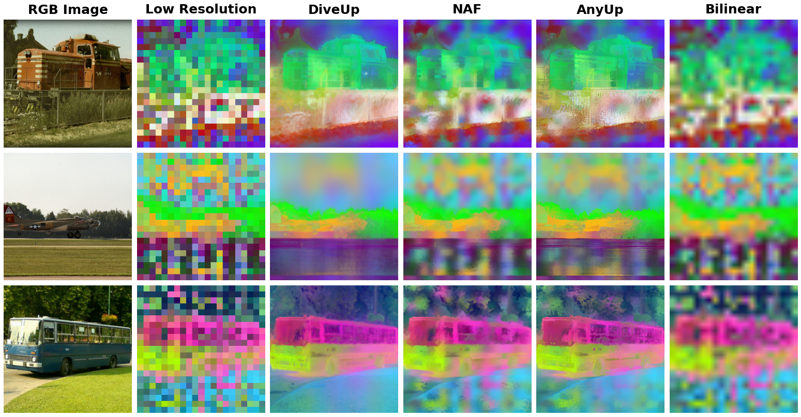

<div align="center">

# 🤿 DiveUp: Learning Feature Upsampling from Diverse Vision Foundation Models

[](https://arxiv.org/abs/xxxx.xxxxx)
[](https://opensource.org/licenses/MIT)

*A lightweight, VFM-agnostic spatial interpolation framework that preserves intrinsic geometric structures without altering the original semantic space.*

[**Project Page**](https://github.com/Xiaoqiong-Liu/DiveUp) | [**Paper (arXiv)**](https://arxiv.org/abs/xxxx.xxxxx) | [**Weights**](https://huggingface.co/Xiaoqiong-Liu/DiveUp)

</div>

---

> **Abstract:** Current feature upsampling relies on intra-model self-reconstruction, often overfitting to source artifacts. We introduce DiveUp, an encoder-agnostic framework that utilizes multi-VFM relational guidance to break single-model dependency. By employing a universal local center-of-mass (COM) field and a spikiness-aware selection strategy, DiveUp aggregates structural consensus from diverse VFMs. This jointly-trained model achieves state-of-the-art zero-shot upsampling across diverse spaces like SigLIP and DINOv2 without per-model retraining.

<div align="center">
  
  <p><em>Comparison of upsampled features from different methods. DiveUp is robust against feature noises.</em></p>
</div>

## 📢 News
- **[2026-03]** 🔥 We released the inference code and pre-trained weights for DiveUp!

---

## 🎯 Quick Start — Load and use DiveUp

**Three steps:**

1. **Install NATTEN** (required for neighborhood attention). Installation depends on your PyTorch and CUDA versions; see the [official NATTEN install guide](https://natten.org/install/).
2. **Load DiveUp** via `torch.hub` (no clone needed).
3. **Upsample features**: pass image, low-res features, and target size.

**Usage:**

```python
import torch

device = "cuda" if torch.cuda.is_available() else "cpu"
diveup = torch.hub.load("Xiaoqiong-Liu/DiveUp", "diveup", pretrained=True, device=device)
diveup.eval()

# High-resolution image (B, 3, H, W)
image = ...
# Low-resolution features from any VFM (B, C, h, w)
lr_features = ...
# Desired output spatial size (H_o, W_o)
target_size = (H_o, W_o)

# High-resolution features (B, C, H_o, W_o)
upsampled = diveup(image, lr_features, target_size)
```

**Inputs:**

| Argument       | Shape / type   | Description                          |
|----------------|----------------|--------------------------------------|
| `image`        | `(B, 3, H, W)` | High-res RGB image (e.g. 512×512).  |
| `lr_features`  | `(B, C, h, w)` | Low-res features from your backbone.|
| `target_size`  | `(H_o, W_o)`   | Desired output feature map size.    |

Full training and evaluation code: TBD.

---

## 🔨 Setup

**Inference only (this repo / `torch.hub`):**

- **Python** 3.8+
- **PyTorch** ≥ 2.0
- **NATTEN** (Neighborhood Attention), required for DiveUp. Installation varies by PyTorch and CUDA version; follow the **[official NATTEN install guide](https://natten.org/install/)**.

- Optional: `einops`, `numpy` (used by the model).

**Full codebase (training & evaluation):**  
See the main repository for datasets, configs, and training instructions.

---

## 👍 Acknowledgements

DiveUp is built on the following open-source works. We thank the authors for releasing their code and models.

- **[NAF](https://github.com/valeoai/NAF)** — *NAF: Zero-Shot Feature Upsampling via Neighborhood Attention Filtering* (Chambon et al., Valeo.ai). We use the NAF architecture and neighborhood attention design.
- **[JAFAR](https://github.com/PaulCouairon/JAFAR)** — Joint Attention for Feature upsampling and Restoration (Couairon et al.). 

We also thank [NATTEN](https://github.com/SHI-Labs/NATTEN) for the efficient neighborhood attention implementation.

